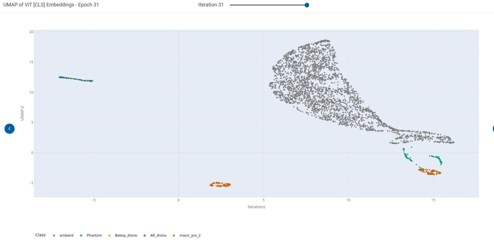

# ViT

# RF Fingerprinting with **SimCLR + ViT** (+ MAE)

*Self-supervised embeddings for drone RF emissions from passive spectrum data.*

---

## Table of Contents
- [Overview](#overview)
- [Highlights](#highlights)
- [Repo Structure](#repo-structure)
- [Configuration](#configuration)
- [Augmentations (RF-aware)](#augmentations-rf-aware)
- [Evaluation](#evaluation)
- [Reproducibility](#reproducibility)
- [Results (placeholders)](#results-placeholders)
- [Troubleshooting](#troubleshooting)
- [FAQ](#faq)
- [License](#license)

---

## Overview
This repo trains a compact **multi-modal** **Vision Transformer (ViT)** with **SimCLR** on **6-channel inputs** (RGB **spectrogram** + RGB **persistence**). A lightweight **MAE** head optionally regularizes early training. The pipeline is **deterministic** (seedable) and fully **instrumented** with ClearML.

> [!TIP]
> Six channels = 3 for spectrogram (RGB) + 3 for persistence (RGB) → tensor shape **[6, H, W]**.

---

## Highlights
- **6-channel aware** data path (spectrogram RGB ×3 + persistence RGB ×3).
- **Deterministic** augmentations: per-call `torch.Generator` reseeds Python/NumPy/Torch.
- **RF-aware augs** incl. **SpecAugment** (time/freq masks) on tensors.
- **Compact ViT** (`D=128`, `L=6`, `H=4`) — edge-friendly; projector dropped at inference.
- **MAE** regularizer (masked pixel MSE) you can anneal to **0** mid-training.
- Clear **probes & metrics**: linear/MLP, Silhouette/DB, UMAP visualization.

---

## Repo Structure

- augmentations.py      | RF-aware augs (seedable) + SpecAugment time/freq masks
- data_loader.py        | ClearML dataset loader, dual-view SimCLR wrapper, DataLoaders
- dataset.py            | (H,W) -> RGB tensors; returns [6,H,W] (train: two views; eval: one)
- transformer_model.py  | PatchEmbed + ViTEncoder (CLS) + ProjectionHead + MAE module
- utils.py              | CFG (hyperparams), determinism helpers
- training notebook / script  | main loop, probes, UMAP, ClearML logging

## Configuration

Edit in `utils.py`.

| Group        | Key               | Default | Notes                                                    |
|-------------:|:------------------|:-------:|:---------------------------------------------------------|
| **Model**    | `IMAGE_SIZE`      | 252     | With `PATCH_SIZE=14` → **18×18 = 324** tokens            |
|              | `PATCH_SIZE`      | 14      | Attention cost ∝ `(N+1)^2`                              |
|              | `EMBED_DIM`       | 128     | ViT width                                                |
|              | `DEPTH`           | 6       | ViT layers                                               |
|              | `NUM_HEADS`       | 4       | MHSA heads                                               |
| **Projector**| `HIDDEN_DIM`      | 512     | MLP hidden                                               |
|              | `PROJECTION_DIM`  | 128     | Output dim for SimCLR                                    |
| **SimCLR**   | `TEMPERATURE`     | 0.015   | Lower = sharper logits (watch collapse)                  |
| **MAE**      | `LAMBDA_MAE`      | 0.01    | Set **0** to disable                                     |
| **Train**    | `EPOCHS`          | 150     |                                                          |
|              | `BATCH_SIZE`      | 256     |                                                          |
|              | `NUM_WORKERS`     | 10      | Set **0** for strict determinism                         |
| **Optimizer**| `BASE_LR`         | 1e-2    | AdamW                                                    |
|              | `ENCODER_LR`      | 1e-3    | 0.1 × BASE_LR                                            |
|              | `PROJECTOR_LR`    | 1e-2    | 1.0 × BASE_LR                                            |
| **Scheduler**| `ETA_MIN`         | 1e-6    | Cosine anneal target                                     |

---

## Augmentations (RF-aware)

Implemented in `augmentations.py`.

- **Spatial / appearance**
  - `RandomResizedCrop`, `RandomHorizontalFlip`, `RandomVerticalFlip`*
  - `add_noise(std=0.05)`, brightness/contrast jitter
  - `GaussianBlur`, `RandomErasing`, `Normalize(mean=0.5, std=0.5)` per channel
- **SpecAugment (tensors)**
  - `time_mask` (zero columns) ~ **10%** width × **2**
  - `freq_mask` (zero rows) ~ **10%** height × **2**
- **Determinism**
  - Pass a `torch.Generator` into `RFSimCLRAug`; the pipeline reseeds Python/NumPy/Torch per call.
  - Dual-view dataset **clones** the generator so views are different but reproducible.

> [!WARNING]
> **Vertical (frequency) flip is aggressive.** Disable if absolute frequency is part of class identity.

---

## Evaluation

- **Probes:** Logistic Regression (linear) & 1-layer **MLP** on **clean** eval loaders (no augs)
- **Clustering:** **Silhouette** (↑) and **Davies–Bouldin** (↓)
- **Visualization:** **UMAP** (cosine), logged to ClearML (or save as `docs/umap.png`)
- **Collapse check:** `z_var_mean` on **L2-normalized** CLS embeddings (often logged ×1e4 for readability)

---

## Reproducibility

- Global seeding (`set_seed`): Python/NumPy/Torch; deterministic algorithms; **TF32/Flash SDP off**
- DataLoader: supply a `generator` and `worker_init_fn` to seed each worker
- Augmentations: per-call `torch.Generator` reseeds torchvision ops

---

## Results 

| Metric             | Value |
|-------------------:|:-----:|
| Linear Acc         | **99.31%** |
| Linear Macro-F1    | **91.01%** |
| MLP Acc            | **98.75%** |
| MLP Macro-F1       | **82.10%** |
| Silhouette (↑)     | **0.8018** |
| Davies–Bouldin (↓) | **5.85** |

UMAP:

